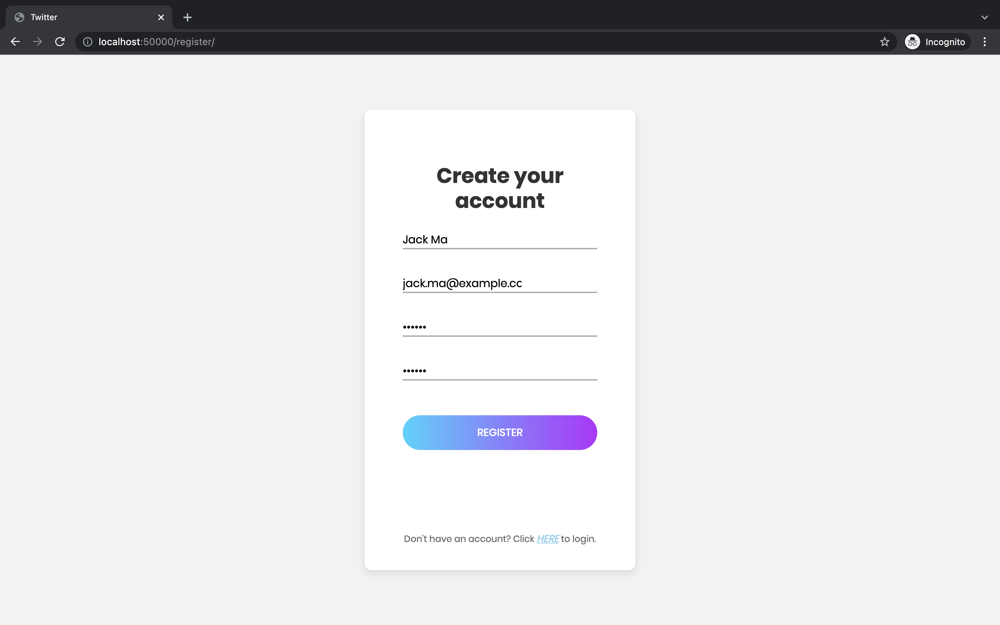
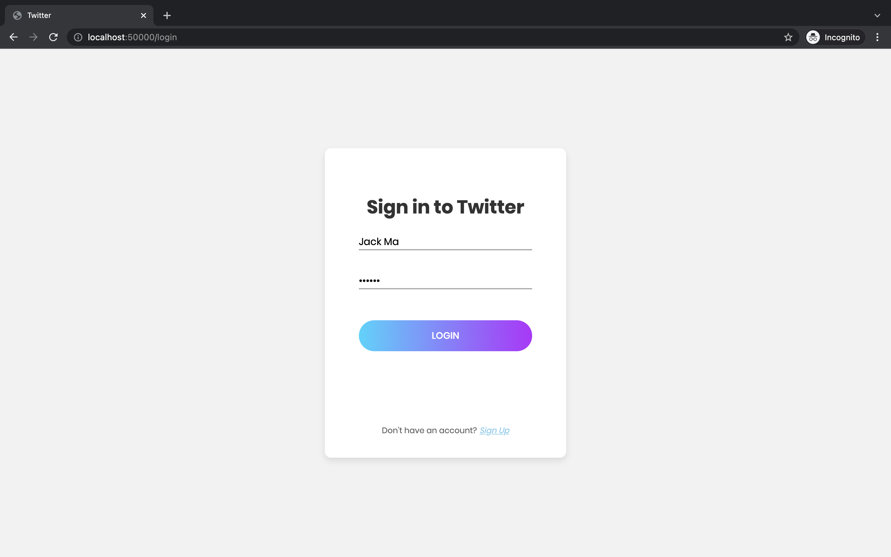
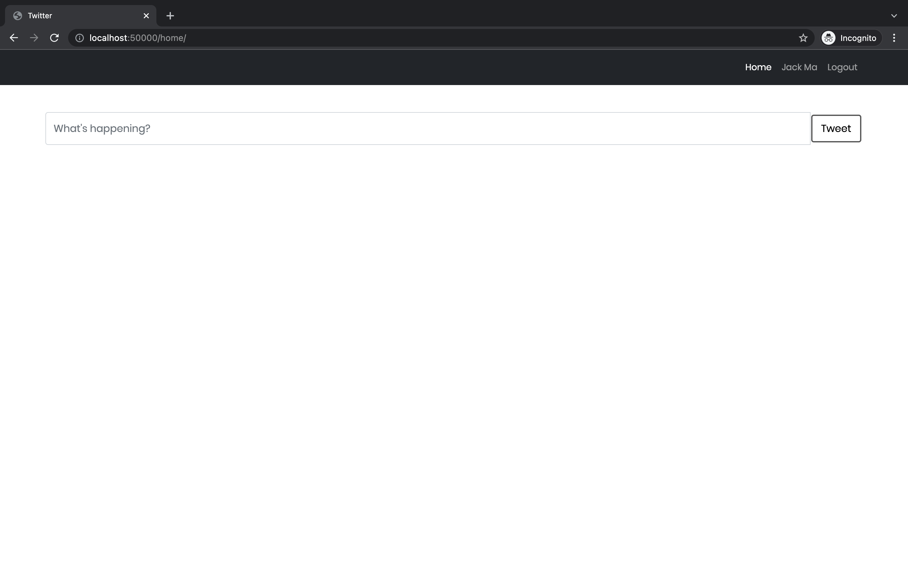
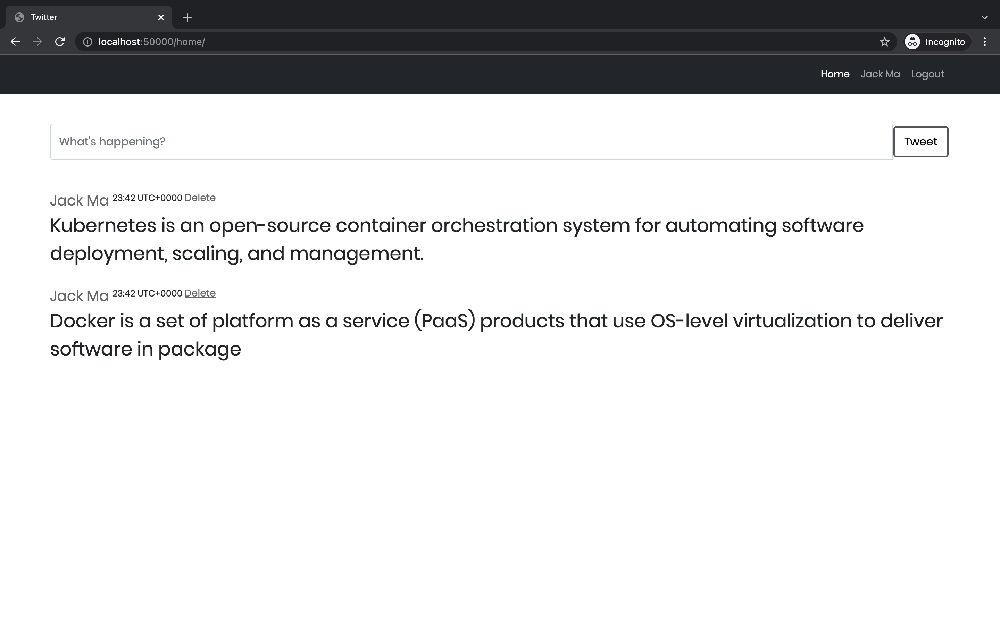
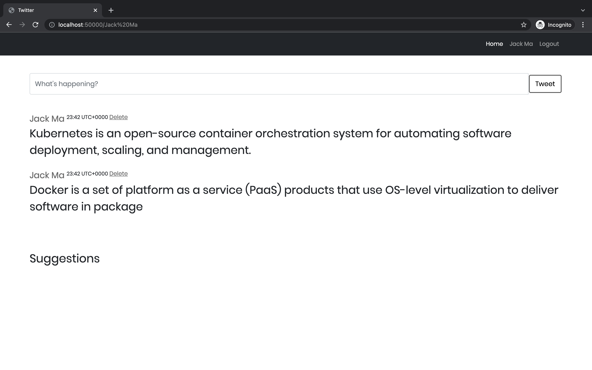
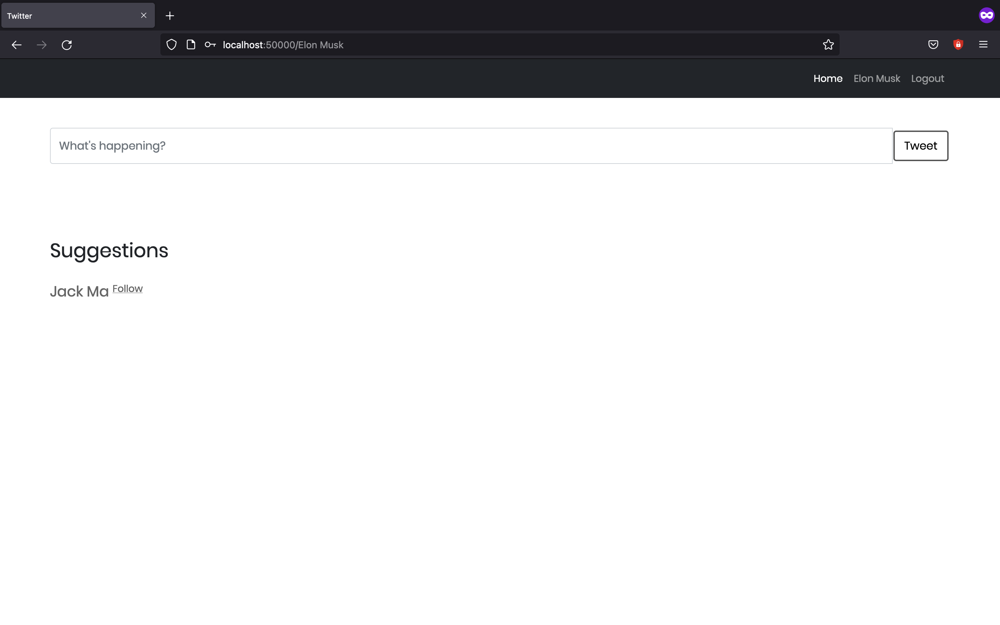
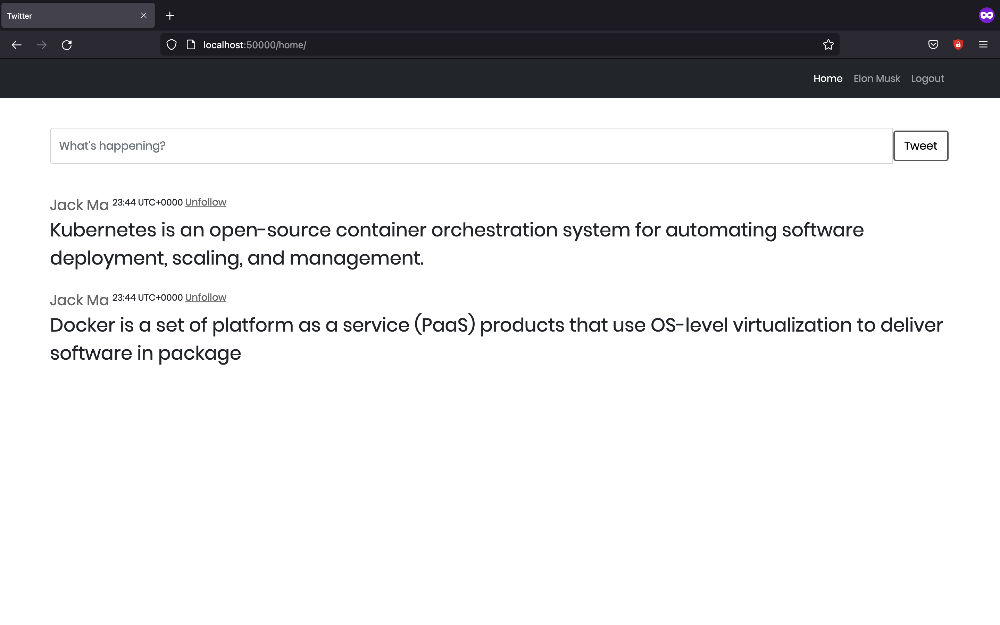
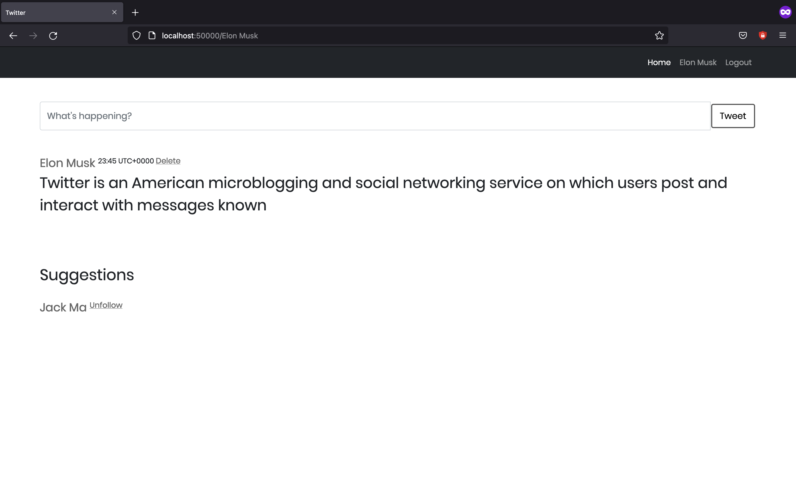
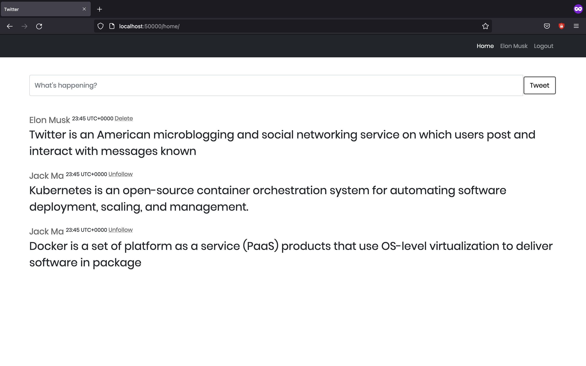

# Design a Simplified Version of Twitter

## Overview

### Prerequisites
We will be installing the tools that we'll need to use for getting our environment set up properly.
1. [Install Docker](https://docs.docker.com/get-docker/)
2. [Docker Compose](https://docs.docker.com/compose/install/)

### Technologies
* [Flask](https://flask.palletsprojects.com/en/1.1.x/) - API webserver
* [SQLAlchemy](https://www.sqlalchemy.org/) - Database ORM
* [PostgreSQL](https://www.postgresql.org/) - Relational database
* [Docker](https://www.docker.com/) - An application build and deployment tool
* [Dcoker Compose](https://docs.docker.com/compose/) - A tool for defining and running multi-container Docker applications

## Project Setup
The project has been set up such that we could be able to have the project up and running with docker compatible machine.


### Application Deployment 
1. Clone this repo
```
git clone https://github.com/MrinmoiHossain/Design-a-simplified-version-of-Twitter.git
```
2. Go to the folder
```
cd Design-a-simplified-version-of-Twitter
```
3. Run the docker-compose file
```
docker-compose up -d
```
4. (Optional) Stop with docker-compose file
```
docker-compose down
```

### Application Endpoints
- ```http://localhost:50000/health``` - Application Heathcheck
- ```http://localhost:50000``` or ```http://localhost:50000/login``` - Application Login
- ```http://localhost:50000/home``` - Application Homepage
- ```http://localhost:50000/<username>``` - User profie
- ```http://localhost:50000/logout``` - Application Logout


### Application Demo
- Login Page

- Registration Page

- Login Page

- Home Page

- Home Page after Tweet

- Profile Page after Tweet

- Another User Profile Page

- Another User Profile Page after Follow

- Another User Home Page after Follow

- Another User Profile Page after Tweet

- Another User Home Page after Tweet



### Current Issues
- UI error handeling issues
- Tweet post timing (getting post current timestamp using server time, not local user time)

### Future Improvements
- Application full test coverage
- Application log formate
- Tweet timestamp using client local time
- Follow/Unfollow counting for a user
- Tweet edit option enable for a user
- Tweet post using pagination

### Credits
-  For Frontend UI (Login/Registration Page): [Login Form v2 by Colorlib](https://colorlib.com/wp/template/login-form-v2/)